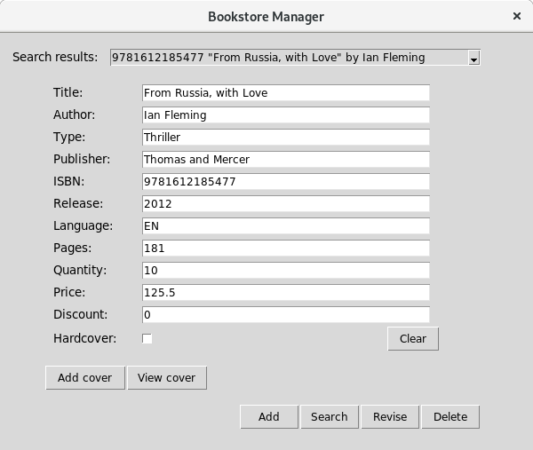

# bookmeister

Application is part of **university project**. Idea was to create online **bookstore**. Module presented here is 
responsible for connection with database **REST API**. It allows to store, load, update and delete records from books 
collection. Main goal of this part was to design simple and **intuitive GUI** for bookstore **employees**. Description below 
walks through its features.



## Features
- form validation before sending values to [database](https://restdb.io/)
- search by one or many parameters
- easy edit of data: form autofill when record chosen from search results
- upload / download (view) of book cover
- display of notification after performing action


## Installation
```
$ git clone https://github.com/ethru/bookemister.git
$ pip install bookemister/. --user
```

## Description
Each form field must be validated by application before sending value to database. Generally length is checked, but 
fields listed below have additional conditions:
- ISBN : is 13 digits number validated by formula described 
[here](https://isbn-information.com/check-digit-for-the-13-digit-isbn.html)
- Release : year when book was published (number)
- Language : two characters code according to [ISO 639-1](https://en.wikipedia.org/wiki/List_of_ISO_639-1_codes)
- Pages, Quantity, Discount (%) : value need to be integer
- Price : is float number

When provided data are other than expected proper notification will be displayed, e.g.

 

Same type of notifications is used in case of database connection errors. 

When operation is performed successfully user is informed by pop-up window aswell.

## How to use
- **add** new record to database
    - fill the form with book description
    - tick box when book has hardcover
    - press "Add" button
    - when error notification occurs correct field and try again
- **search** record in database
    - fill one or many form fields and press "Search" button
    - "Search results" list will be populated by records matching criteria
    - first matching result will be loaded to application form
- **update** record
    - use search option to find and select record first
    - change fields in form and press "Revise" button
- **delete** record
    - use search option to find and select record first
    - press "Delete" button
- **add** record **cover** image
    - use search option to find and select record first
    - press "Add cover" button
    - pick image in pop-up window and confirm with "Open" button
- **view** record **cover** image
    - use search option to find and select record first
    - press "View cover" button
    - image or error notification will be displayed
- **clear** form
    - press "Clear" button
    - all values from fields and "Search results" will be removed

## Project Information
##### Requirements:
- Python3.7+
- Check [requirements.txt](requirements.txt) file to see used modules and their version.

##### Author: Adrian Niec
##### This project under the MIT License - see the LICENSE file for details
